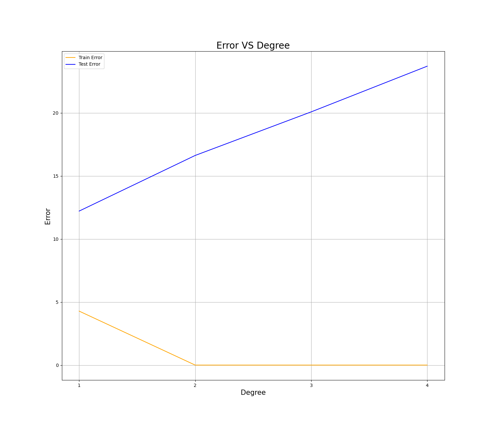
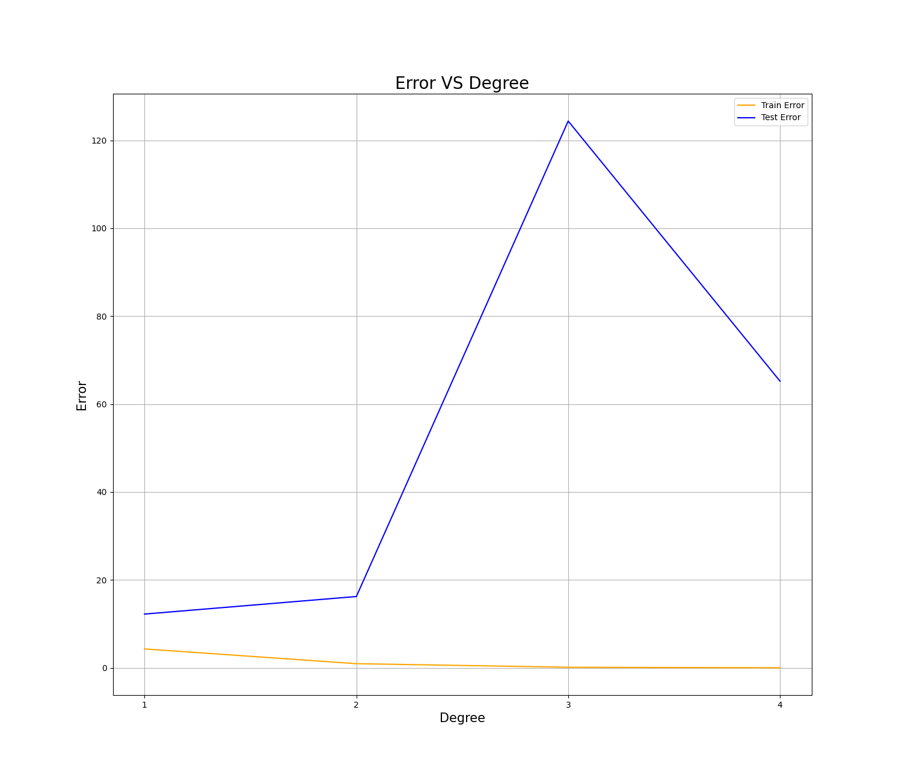
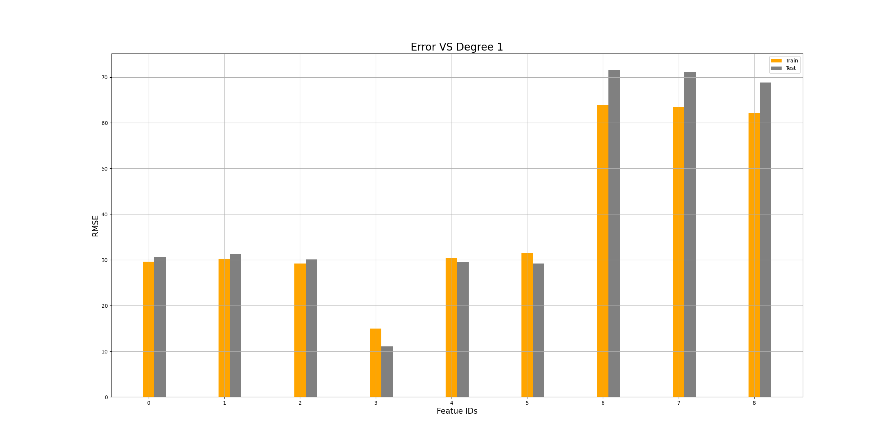
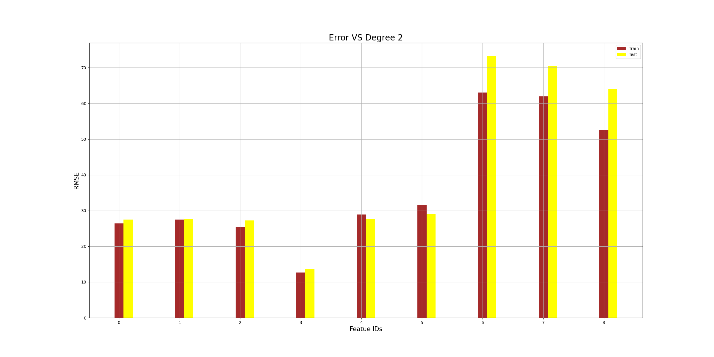
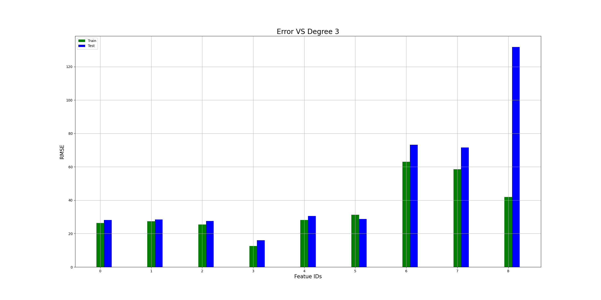
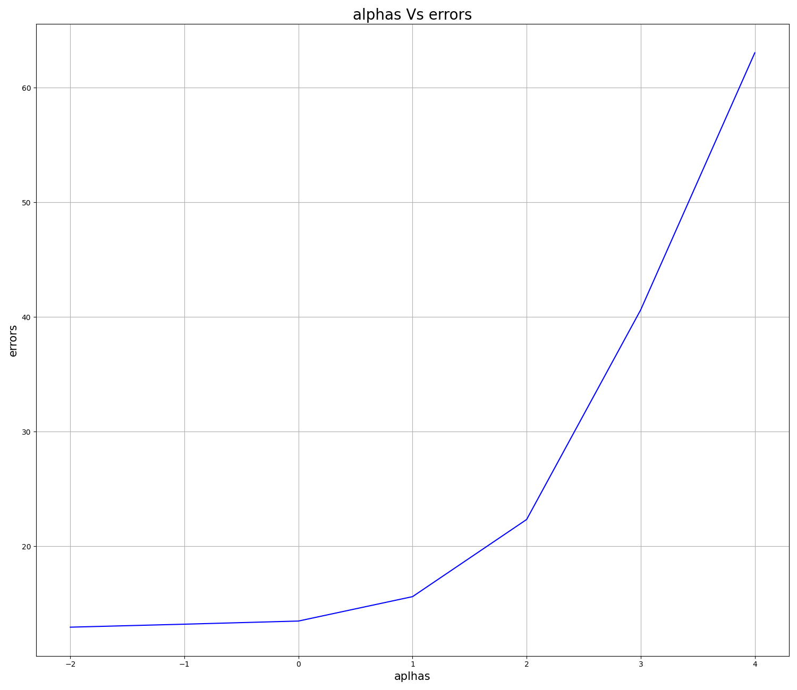
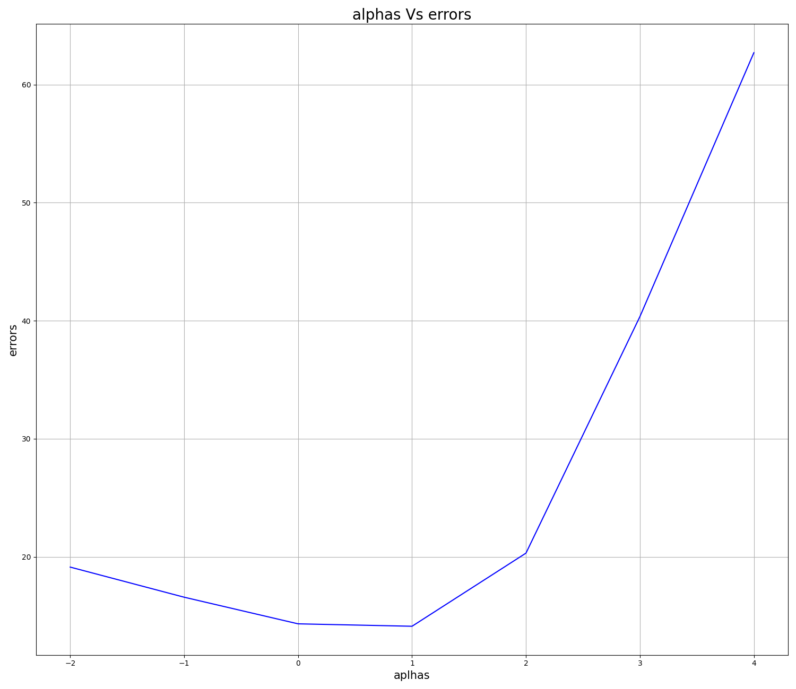

# Home Work II - Modeling Concepts

---
- ## Task1: KISS (Keep it simple, stupid!)
    ### Output
    ```
    intercept          :  -19.7551234890215
    wights abs average :  49.72377821665948
    Train RMSE         :  4.2812497301536645
    Test RMSE          :  12.216701916378916
    ```

- ## Task2: Polynomial for all features v1
    - ### Output:
    ```
    - Degree: 1
            X_new features number: 31
            intercept: [-19.75512349]
            Train RMSE: 4.281249730153667
            Test RMSE: 12.216701916378918

    - Degree: 2
            X_new features number: 496
            intercept: [11.31311414]
            Train RMSE: 1.1001078440916858e-13
            Test RMSE: 16.6285089659521

    -----------------------------------------------
    - Degree: 3
            X_new features number: 5456
            intercept: [28.12257897]
            Train RMSE: 1.6794028355499308e-13
            Test RMSE: 20.08528508159528
    -----------------------------------------------

    - Degree: 4
            X_new features number: 46376
            intercept: [33.64764174]
            Train RMSE: 2.61508295340475e-13
            Test RMSE: 23.709849327883024
    ```
    - ### Visualization:
    


- ## Task3: Polynomial for all features v2
    - ### Output:
    ```
    - Degree: 1
            X_new features number: 30
            intercept: [-19.75512349]
            Train RMSE: 4.2812497301536645
            Test RMSE: 12.216701916378916

    - Degree: 2
            X_new features number: 60
            intercept: [11.42806087]
            Train RMSE: 0.9289143055517077
            Test RMSE: 16.210208256362492

    -----------------------------------------------
    - Degree: 3
            X_new features number: 90
            intercept: [68.20895051]
            Train RMSE: 0.10977147807921725
            Test RMSE: 124.40060793885075
    -----------------------------------------------

    - Degree: 4
            X_new features number: 120
            intercept: [80.92610736]
            Train RMSE: 6.307379521052447e-13
            Test RMSE: 65.21315088844389
    ```
    - ### Visualization:
    

#### Error in V2 Monomial for all features greater than error in the previous version V1 Polynomial for all features.

- ## Task4: Individual features
    - ### Visualization: Error Vs Degree 1 with first 9 features.
    
    - ### Visualization: Error Vs Degree 2 with first 9 features.
    
    - ### Visualization: Error Vs Degree 3 with first 9 features.
    


- ## Task5: Regularized polynomial regression
    - ### Output:
    ```
    best_alpha 0.01
    best_score:  0.999888908408828
    alphas:  [0.01, 0.1, 1, 10, 100, 1000, 10000]
    error [12.95476924 13.21357602 13.48818532 15.61680063 22.34416587 40.62997675
    63.04211358]
    ```
    - ### Visualization:
    


- ## Task6: Lasso Selection
    - ### Output:
    ```
    best_error:  9.21946995150132
    selected_features: ['F03', 'F04', 'F12', 'F13', 'F16', 'F21', F24', 'F25', 'F26', 'F27', 'F29']
    best_alpha 10
    best_score:  0.9761152700965451
    alphas:  [0.01, 0.1, 1, 10, 100, 1000, 10000]
    error [19.13349773 16.58309086 14.32798417 14.12240442 20.31611572 40.35125196
    62.70223685]
    ```
    - ### Visualization:
    

#### By compare ridgge with allfeatures and ridgge with selected features we see that the error is decrased.