# Linear Regression
## `I` - what is linear regression?
#### Linear Regression is a [supervised learning](https://en.wikipedia.org/wiki/Supervised_learning) algorithm in machine learning, which is widely used for solving regression problems. Regression is a type of machine learning problems where the goal is to predict a continuous output variable based on one or more input variables.

---
## `II` - Linear regression structer
### 1 - Line equation
#### Linear regression begins with the line equation `y = m*x + c`, which is simple. You have the parameters of the line, `m` and `c`, so you can take any input `x` and return the output `y`.
- #### `m` is the slope of the line (also called the weight),
- #### `c` is the intercept (the value of `y` when `x = 0`)

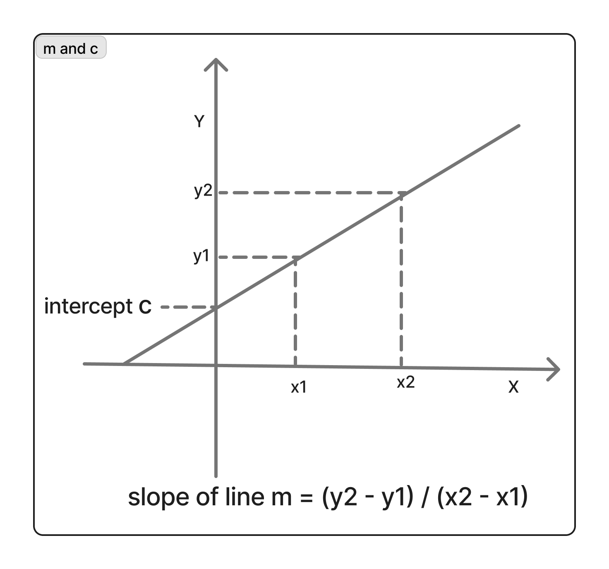

### 2 - Linear regression in real problem

#### One of the most pobuler examples of linear regression usage, is house price prediction. Let's assume that we have a dataset that contains two columns: `house_size` as the input variable and `house_price` as the output variable.

#### The goal of linear regression is to learn the relationship between the input variable `house_size` and the output variable `house_price`, in order to predict the `house_price` of new houses based on their `house_size`.

#### For example if we have two examples:
- #### in the first the example `house_size = 4` and the `house_price = 2`.
- ####  in the second the example `house_size = 8` and the `house_price = 4`
#### We observe that the `house_price = house_size / 2` in this two previous examples. So, if we have a new example with `house_size = 6` we can predict that the `house_price = 3`

#### Let's take a example of a simple dataset:
| House Size | House Price |
|:----------:|:-----------:|
|     39     |     23      |
|     40     |     27      |
|    42.5    |    28.6     |
|     47     |     30      |
|     49     |     29      |
|     53     |     33      |
|     55     |   36.75     |
|     58     |     38      |
|     60     |    40.5     |
|     62     |    41.3     |

#### Dataset distribution graph.
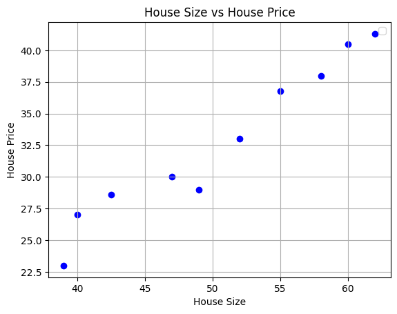

#### We observe that our data follows a linear distribution, so we can generate a line that represent the most points of our dataset.
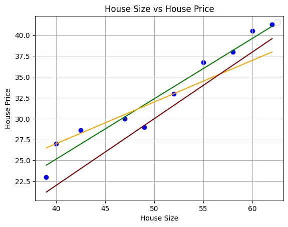

#### You can look at the graph to select the best fitting line among the three.

#### Visually, the green line appears to be the best fit. But how can we determine that computationally? How does a program judge which line is better than the others?
#### A program can judge which line is better than the others, by using cost function

### 3 - Cost or error function

#### The cost (or error) function calculates the average error for a given line. The error is the difference between the actual house price `y_r` and the predicted house price `y_p`.

#### `Cost = (y_p - y_r)²`
#### `y_p = m*x + c`
#### `cost = ((m*x+c)-y_r)²`

#### We use the exponent `²` to avoid negative values, because the difference `y_p - y_r` can be either positive or negative. Although we can use the absolute value, but squaring the error is generally preferred for several reasons.

#### A graph to simplify the cost

#### To count the average value of error we aplly the cost function over all points of data, the exprission of average also named mean squared error  is shown in the image below

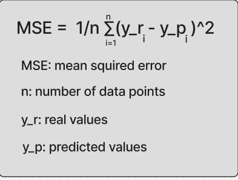

#### We compute the error in eash point and sume the errors. after that we divides the sume of errors over the number of points, finily we get the average value of error for our line

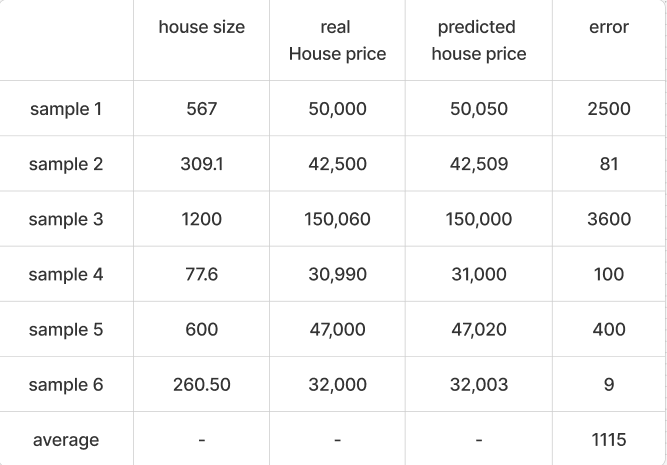

#### Now we can take a set of lines and calculate the cost (or average of error) for each one, and select the line with the minimum error.

#### However, this method doesn't work well in practice, because it requires generating a huge number of lines and hoping that one of them fits the data.

#### We need a way that is optimized and achievable.
#### There are two possible solutions:
- #### [Analytical method (Normal Equation)](#normal-equation)
- #### [Iterative method (Gradient Descent)](#gradient-descent)

### Gradient descent

#### Let's fix `c = -3.82` to observe how m impacts the fitting of the line.

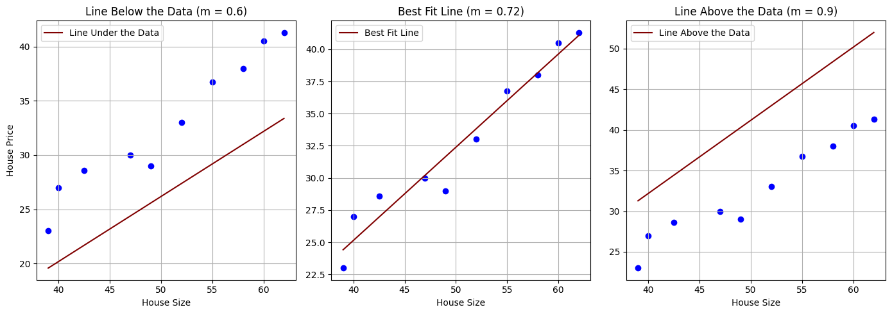

#### When we increment `m`, the line fits the data more closely,  until it reaches the optimal fit at around `m = 0.72`. After this point, further increasing `m` makes the line fit the data less well.
- #### Before` m = 0.72`, increasing `m` reduces the error and improves the fit of the line.
- #### At `m = 0.72`, we achieve the optimal line with the best fit.
- #### After `m = 0.72`, increasing `m` increases the error, and the line fits the data less well.

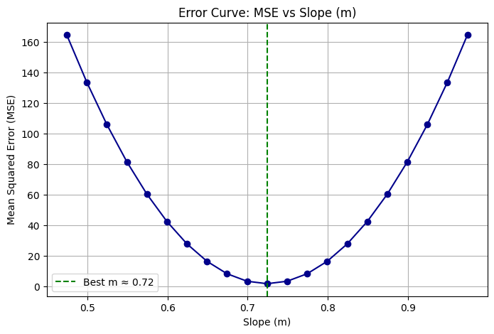

#### Since the cost function is convex, there is a point in the middle that yields the minimum `error`.
#### The goal of our linear regression model is to find this point, where the `cost` is optimal.

#### Once again, we require an approach that enables the program to find the minimum `cost` effectively.

#### Let's assume that we will initialize `m` by `m = 0.5`. What should we do to reach the minimum, increase or decrease `m`?

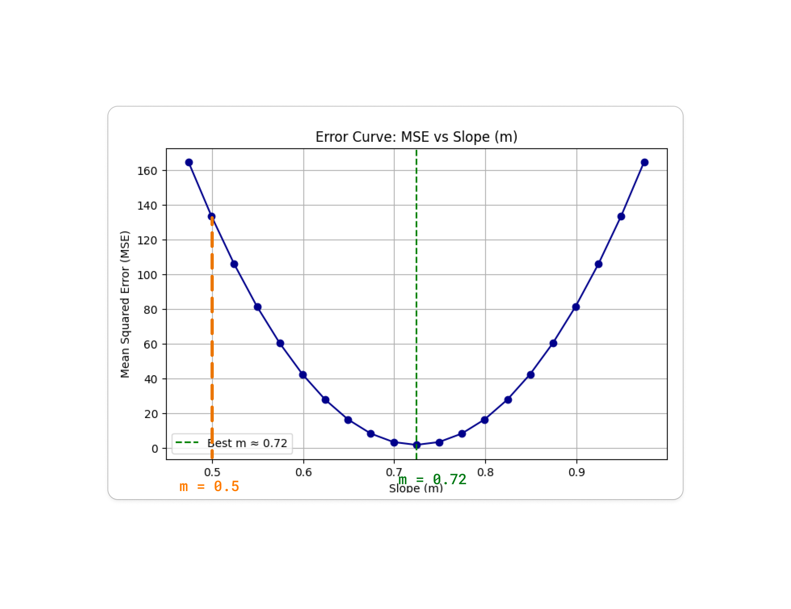

#### You can try to answer about this question.

#### It's simple we should increase `m` to reach the optimat point `m ≈ 0.72`

#### Now let's assume that we will initialize `m` by `m = 0.95`, what should we do this time?
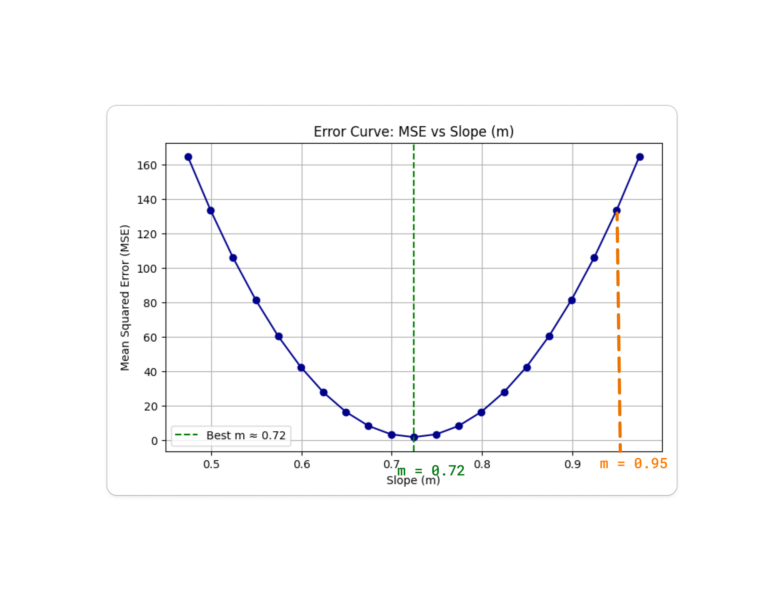

#### We should decrease `m` to move toward the optimal point `m ≈ 0.72`

#### So how we can know whethr we need to increase or decrease `m`?

#### This is where the derivative helps.

#### We take the derivative of the cost function with respect to`m`, because we are keeping `c` constant, which is:
#### The cost is:  `cost = ((m*x+c)-y)²`

#### Taking the derivative with respect to m: `d(cost)/dm = 2 ((m*x+c)-y) * x` 

#### If we start from the left (e.g., `m = 0.5`), the derivative is negative because the curve is going down.

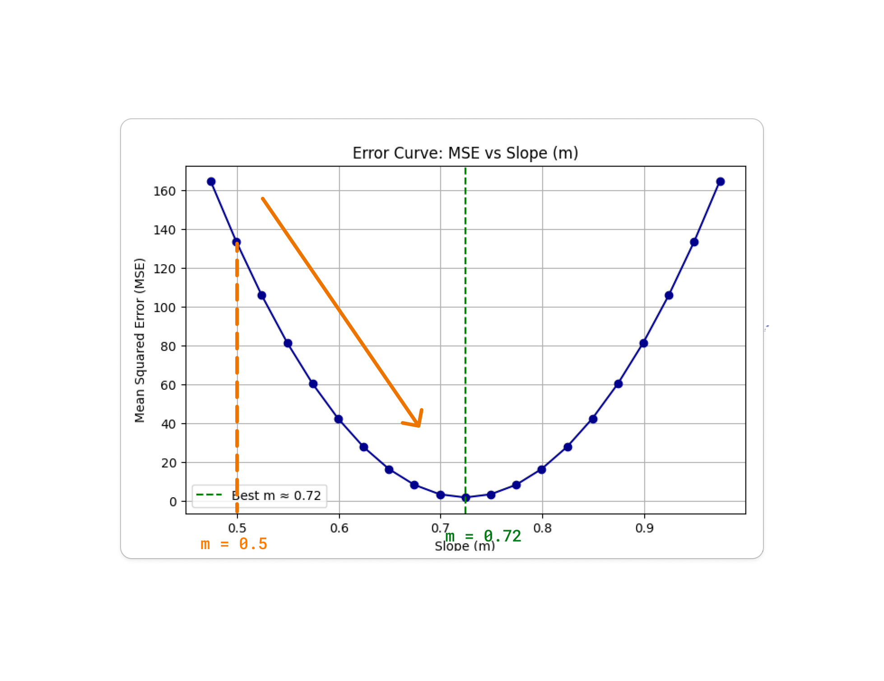

#### Since we want to increase `m`, we use the update rule `new_m = m - grd`, where grd represents the derivative.

#### If `grd = -0.1`, then:
#### `new_m = 0.5 - (-0.1)`
#### `new_m = 0.6`

#### The derivative remains negative as long as we are to the left of the minimum.

#### So, by repeatedly applying the rule `new_m = m - grd`, we gradually move toward the value of `m` that gives the optimal error.

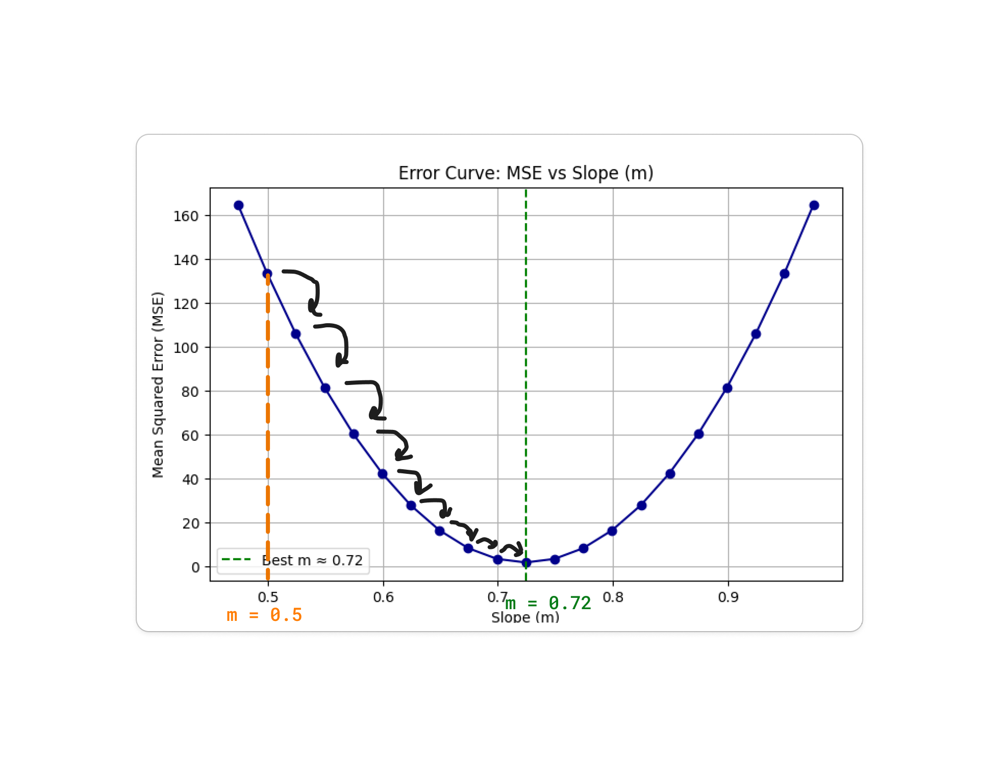

#### If we take a point from the right of the minimum(e,g, `m = 0.95`), the derivative is positive, because the curve going up.
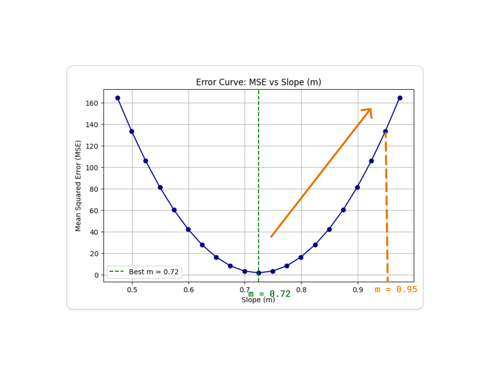

#### Now we want to decrease `m`, here also we use the update rule `new_m = m - grd`.

#### If `grd = 0.1`, then:
#### `new_m = 0.95 - 0.1`
#### `new_m = 0.85`

#### The derivative remains positive as long as we are to the right of the minimum.

#### So, by repeatedly applying the rule `new_m = m - grd`, we gradually move toward the value of `m` that gives the optimal error.

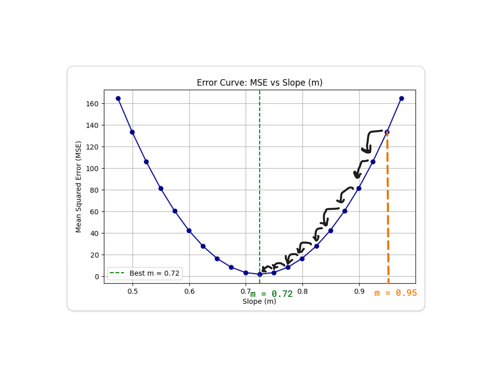

#### Until now, we’ve seen how to move toward the minimum, but how do we know when we've reached it?

#### Sience the derivative in the minimum of the curve is very small or equal to zero.

#### So we repeat this process until the derivative is close to zero.
#### `grd ≈ 0` 
#### `new_m = m - grd`
#### `new_m ≈ m`

#### Finally, by following the above steps, we can find the best line that fits our data. This line is defined by its parameters `m` and `c`, and we can use it to predict new values. To make a prediction, we simply provide an input `x`, and compute: `y = m*x + c` where `y` is the predicted output.

#### Now that we have covered linear regression with one feature `x`, what about using two or more features? The linear regression model still works in this case, we just need to make a few small adjustments to the equation.

#### Let's take a example of two features `x1`, `x2`.
#### The equation will be `y= m1*x1 + m2*x2 + c*1`
#### We can represent `m1` & `m2` & `c` by a vector of wights `W = {m0, m1, m2}` where `m0 = c`, `x1` & `x2` & `1` by `X = {x0, x1, x2}` where `x0=1`
#### The equation will be `y = W * X` = `x0*m0 + x1*m1 + x2*m2`

#### For n features `y = W * X` = `x0*m0 + x1*m1 + ... + xn*mn`

### Normal Equation
- #### not complete 

---
#### This is just a simple example of the theory behind linear regression. For the implementation, you can check [here](42ft_linear_reg/README.md)

