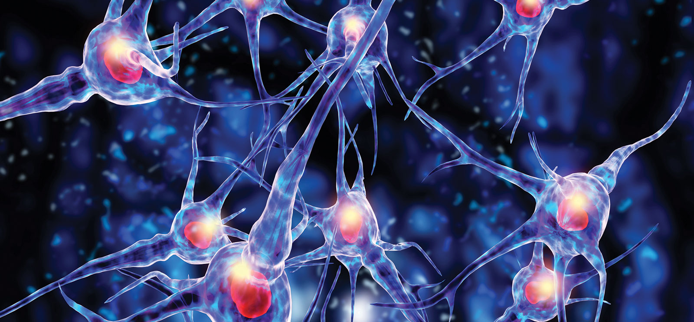

## Not complete in progress!!!
# Neural Network
#### To follow up in neural network is recommended to take a view about [Linear Regression](../LinearRegression/README.md)

### what is neural network
##### A neural network is a machine learning program, or model, that makes decisions in a manner similar to the human brain, by using processes that mimic the way biological neurons work together to identify phenomena, weigh options and arrive at conclusions. 

