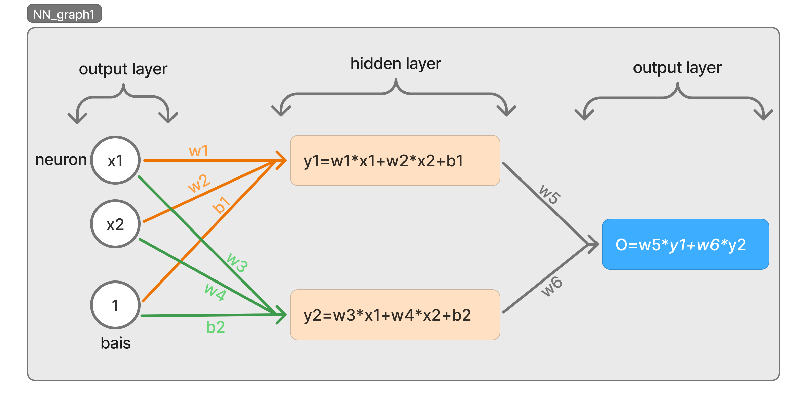

## Not complete in progress!!!
# Neural Network

## what is neural network?
#### A neural network is a machine learning program, or model, that makes decisions in a manner similar to the human brain, by using processes that mimic the way biological neurons work together to identify phenomena, weigh options and arrive at conclusions. 

---
## Neural Network prerequests
- #### Linear Regression [MyDocs](../LinearRegression/README.md)
- #### Graph Theory
  - 
- #### Chain Rule derivative
  - 
  - 
---
## Why Neural Network?
### Neural Network come to resolve the limitations of teaditional Regression models
- #### Regression models like linear regression and logistic regression are not capable of learning non-linear patterns, complex interactions, or hierarchical representations.
- #### Regression models can use techniques like polynomial features to capture non-linear patterns, but this often leads to increased computational time and model complexity.
- #### Regression models struggle with High-Dimensional Data Neural Network can handle high-dimensional input, such as images, audio, or sequences.
---

## Neural Network Structer
#### Neural Network start from a linear regression model
#### lets represent the Linear Regresion as a graph

#### Neural networks start from the foundation of linear models like linear regression, and extend them by adding hidden layers and non-linear activation functions, allowing them to learn more complex patterns.

#### In the graph below, we extend the linear regression model by adding a hidden layer in the middle. Without apply any activation function.

#### Since we do not apply any activation function, the overall transformation remains linear:

#### `O = w5*y1 + w6y2`

#### `O = w5*(x1*w1+w2*x2+b1) + w6*(x1*w3+w4*x2+b2)`

#### `O = x1*w1*w5 + x2*w2*w5 + b1*w5 + x1*w3*w6 + x2*w4*w6 + b2*w6`

#### For example `x1*w1*w5` it still a linear transformation and we can summarize `w1*w5` in `w` => `x1*w1*w5` = `x1*w` just a single `w` can do the same effect so it still a linear regression model

#### But we need to make it a non-linear transformation this is why we add activation functions

### Neural Networks Layers and Neurons
#### A neural network consists of a set of layers, and each layer contains a number of neurons.

- #### The first layer: is the input layer. It contains all the input features, with each feature represented by a neuron.

- #### The last layer: is the output layer. It contains the output probabilities. The output may consist of a single value, as in linear regression, or multiple values like in classification tasks where there are two or more classes. Each output probability is represented by a neuron.

- #### The middle layers are called hidden layers. The number of hidden layers and the number of neurons in each layer are not fixed. They are typically chosen based on experience and experimentation to best fit the problem being solved. In the neurons of the hidden layers, we apply a non-linear function called an activation function.

---
### Feed forword (practice examlple)
#### Let's assume that the activation function f is the square function, `f(x) = x^2`

---
## Content
- [x] **introduction to Neural Netwirk**
- [x] **Neural Network structer**
- [ ] **practice examlple (feed forword)**
- [ ] **Backpropagation**