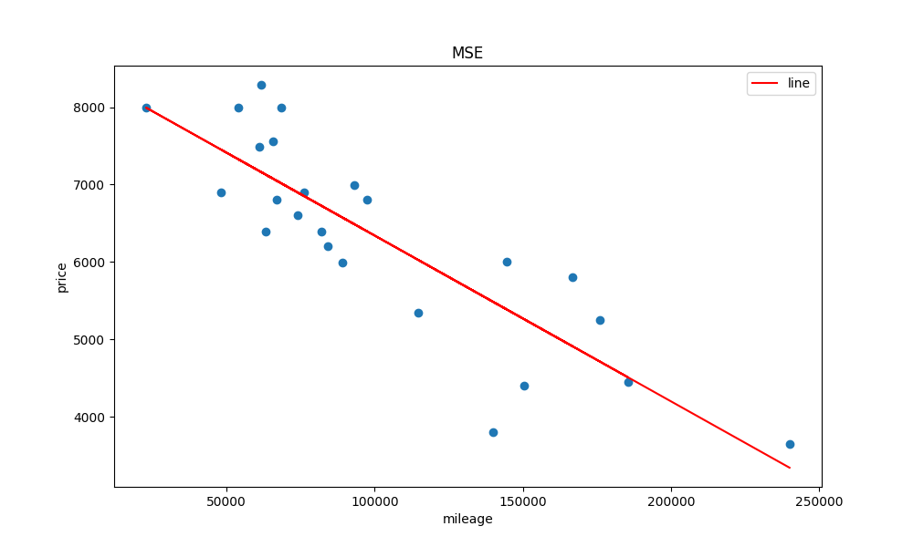

# 🚗 ft_linear_regression *(Gradient Descent from Scratch)*
---
### [View the 42 Network Project Subject](https://cdn.intra.42.fr/pdf/pdf/102546/en.subject.pdf)
[⬅️ Back to Main ML Portfolio](../../README.md)

## 📋 Overview

`ft_linear_regression` is a core project from the 42 Network. The aim of this project is to introduce the foundational mathematics behind machine learning. 

For this project, I created a program that predicts the price of a car using a linear function trained with a custom **Gradient Descent** algorithm, built entirely from scratch without using high-level ML libraries for the training loop.

---

## 1. Data Snapshot

### Sample from `data.csv`

| km     | price |
|--------|-------|
| 240000 | 3650  |
| 139800 | 3800  |
| 150500 | 4400  |
| 185530 | 4450  |
| 176000 | 5250  |
| 84000  | 6200  |

* The column `km` represents the kilometers driven by the car.
* The column `price` is the selling price of the car.
* **Goal:** Create a linear regression model that takes `km` as input and accurately predicts the `price` for new, unseen data.

---

## 2. Code Steps & Implementation

### 🧹 Data Preprocessing

**1. Load data from CSV file:**
```python
import pandas as pd

file_name = "data.csv"
data_csv = pd.read_csv(file_name)
```

**2. Split the data into input (X) and target (Y):**
```python
import numpy as np

X = np.array(data_csv["km"]).reshape(-1, 1)
Y = np.array(data_csv["price"]).reshape(-1, 1)
```

**3. Train / Validation Split:**
```python
from sklearn.model_selection import train_test_split

# Train Val Split
X_train, X_val, Y_train, Y_val = train_test_split(X, Y, test_size=0.2, random_state=88)
```
* **Why this matters:** I used 80% of the data for training and kept 20% for testing. Fixing the `random_state` to 88 ensures reproducibility by controlling how the data is shuffled before splitting.

**4. Feature Scaling (MinMaxScaler):**
```python
from sklearn.preprocessing import MinMaxScaler

# Scaling features to a range between 0 and 1
scaler_X = MinMaxScaler().fit(X_train)
X_train = scaler_X.transform(X_train)
X_val = scaler_X.transform(X_val)
```
* **Why this matters:** Scaling the data transforms it to a range between 0 and 1. This prevents large coordinate values from causing gradient explosion, allowing the learning rate to smoothly control the jumps of the gradient descent.

---

### ⚙️ Training with Gradient Descent

By inheriting from Scikit-Learn's `BaseEstimator` and `RegressorMixin`, this custom algorithm can integrate smoothly with standard ML pipelines.

**1. Initialize the Model Variables:**
```python
class GradientDescent(BaseEstimator, RegressorMixin):
    def __init__(self, fit_intercept=False, lr=0.1, pr=1e-9, max_itr=10000, W1=None):
        self.fit_intercept = fit_intercept # Add column of ones to input X
        self.lr = lr           # Learning rate
        self.pr = pr           # Precision (convergence threshold)
        self.max_itr = max_itr # Maximum iterations
        self.W1 = W1           # Initial weights
        self.__weights = None
```
*(Note: Weights in a simple linear regression are just m and c. In real-world multi-variable problems, this scales to m1, m2, m3, etc. Matrix operations allow this code to handle any number of features.)*

**2. The Cost Function (Loss):**
Defined mathematically as calculating the Mean Squared Error. To implement this efficiently in Python, I used NumPy for vectorized matrix operations rather than slow `for` loops.
```python
    def cost_f(self, X, Y, W):
        examples = X.shape[0]        # Number of examples (n)
        pred = np.dot(X, W)          # Predicted target
        error = pred - Y
        cost = error.T.dot(error) / (2 * examples)
        return cost[0][0]
```

**3. The Derivative Function (Gradient):**
Calculates the gradient of the cost function to determine the direction of the steepest descent.
```python
    def f_derive(self, X, Y, W):
        n = X.shape[0]               # Number of examples
        pred = np.dot(X, W)
        error = pred - Y
        gr = (X.T @ error) / n       # Final derivative
        return gr
```

**4. The Training Loop (`fit`):**
This loop iterates until the derivative of the cost function approaches zero (based on precision) or reaches `max_itr`.
```python
    def fit(self, X, Y):
        if self.fit_intercept: 
            # The Bias Trick: Add a column of ones to the left side of matrix X
            X = np.hstack([np.ones((X.shape[0], 1)), X])
            
        if self.W1 is None:
            self.W1 = np.random.rand(X.shape[1], 1)
            
        cur_p = self.W1
        last_p = cur_p + 100
        iter_count = 0
        
        while np.linalg.norm(cur_p - last_p) > self.pr and iter_count < self.max_itr:
            last_p = cur_p.copy()
            gr = self.f_derive(X, Y, cur_p)
            cur_p -= gr * self.lr    # Move against the gradient
            iter_count += 1
            
        self.__weights = cur_p.copy()
        return self
```
> **🧠 The "Bias Trick" Explanation:**
> Why do we need to add a column of ones to the input X? 
> In the linear equation y = m * x + c, we can rewrite this as y = m * x + 1 * c to treat both m and c as weights. 
> To express this using matrix multiplication, we represent the weights as a vector W = [c, m], and the input as X = [1, x].
>
> To make this multiplication valid for all data points, we simply add a column of ones to the input matrix X. This incorporates the intercept (c, or bias) as part of the weights vector, drastically simplifying the code implementation.

**5. Prediction & Evaluation:**
```python
    def predict(self, X):
        if self.__weights is None:
            raise ValueError("Model has not been fitted yet!")
        if self.fit_intercept:
            X = np.hstack([np.ones((X.shape[0], 1)), X])
        return np.dot(X, self.__weights)

    def score(self, X, Y):
        # Calculate R-Squared (R²) score
        y_pr = self.predict(X)
        u = np.sum((Y - y_pr) ** 2)
        v = np.sum((Y - np.mean(Y)) ** 2)
        return 1 - (u / v)
```

---

## 📈 Visualization & Inference

- **Visualizing the Fit:** Utilizing `matplotlib.pyplot`, I plotted the actual dataset points against our model's predictions to visually confirm that the algorithm successfully learned the underlying trend in the data.
  
- **State Persistence:** Once the model reaches convergence, the optimized weights are saved to a `weights.csv` file. This allows a separate, lightweight inference script to instantly predict the price of a car for a newly provided mileage without needing to retrain the model.