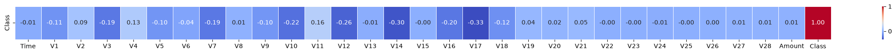
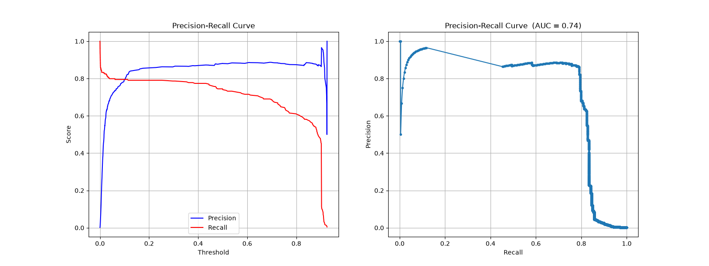

# 💳 Credit Card Fraud Detection *(Logistic Regression, Random Forest, XGBoost, etc.)*
---
### [Project description on Kaggle](https://www.kaggle.com/datasets/mlg-ulb/creditcardfraud/data) 
[⬅️ Back to Main ML Portfolio](../../README.md)

  

## 📋 Overview
- **The Business Problem:** It is critical that credit card companies are able to accurately recognize fraudulent transactions so that customers are not charged for items they did not purchase, while minimizing false alarms that block legitimate transactions.
- **The Dataset:** The dataset contains transactions made by European cardholders in September 2013 over two days. There are 492 frauds out of 284,807 transactions. The dataset is **highly unbalanced**, with the positive class (frauds) accounting for just **0.17%** of all transactions.
- **Exploratory Data Analysis:** 
    - [View my complete EDA Notebook here](./exploration_data.ipynb)

---

## 🛠️ Workflow

### 🧹 1. Data Preprocessing
* **Feature Selection:** Selected highly predictive features (`V7`, `V10`, `V11`, `V12`, `V14`, `V16`, `V17`, `V18`) based on Random Forest feature importance, pairplots, and correlation matrices.
  
  
* **Outlier Treatment:** Handled extreme values using the Interquartile Range (IQR) method to stabilize model training.
* **Data Splitting:** Split the data into dedicated Training and Validation sets.

### 🧠 2. Model Training
* **Hyperparameter Tuning:** Conducted experimental tuning to find optimal hyperparameters for each architecture.
* **Model Fitting:** Trained multiple models including linear algorithms, tree ensembles, and custom-loss implementations.
* **Dynamic Thresholding:** Utilized Precision-Recall curves to identify the exact decision threshold that maximizes the F1-Score for the highly imbalanced data.
  
  
* **State Preservation:** Saved the trained models, the optimized thresholds, and the exact preprocessing parameters to ensure consistent application during inference.

### 🎯 3. Model Evaluation
* **Strict Test Preprocessing:** Applied the exact scaling and bounding parameters extracted from the training dataset to the test dataset. **(Zero data leakage)**
* **Metrics:** Evaluated final models using F1-Score, Precision, Recall, PR-AUC, and the Scikit-Learn Classification Report.

---

## 📊 Model Benchmark Results

| Model | Optimal Threshold | Precision | Recall | F1-Score | PR-AUC |
| :--- | :---: | :---: | :---: | :---: | :---: |
| **Logistic Regression** | 0.25 | 0.75 | 0.82 | 0.79 | 0.94 |
| **Neural Network** | 0.29 | 0.76 | 0.80 | 0.78 | 0.94 |
| **Focal Loss (Logistic Reg)** | 0.31 | 0.76 | 0.85 | 0.80 | 0.94 |
| **Random Forest** | 0.49 | 0.76 | 0.79 | 0.78 | 0.95 |
| **XGBoost** | 0.39 | 0.74 | 0.72 | 0.73 | 0.95 |
| **CatBoost** | 0.31 | 0.77 | 0.84 | 0.80 | 0.96 |
| **LightGBM** | 0.02 | 0.69 | 0.78 | 0.73 | 0.92 |
| **Soft Voting Ensemble** | 0.40 | 0.76 | 0.85 | 0.80 | 0.94 |